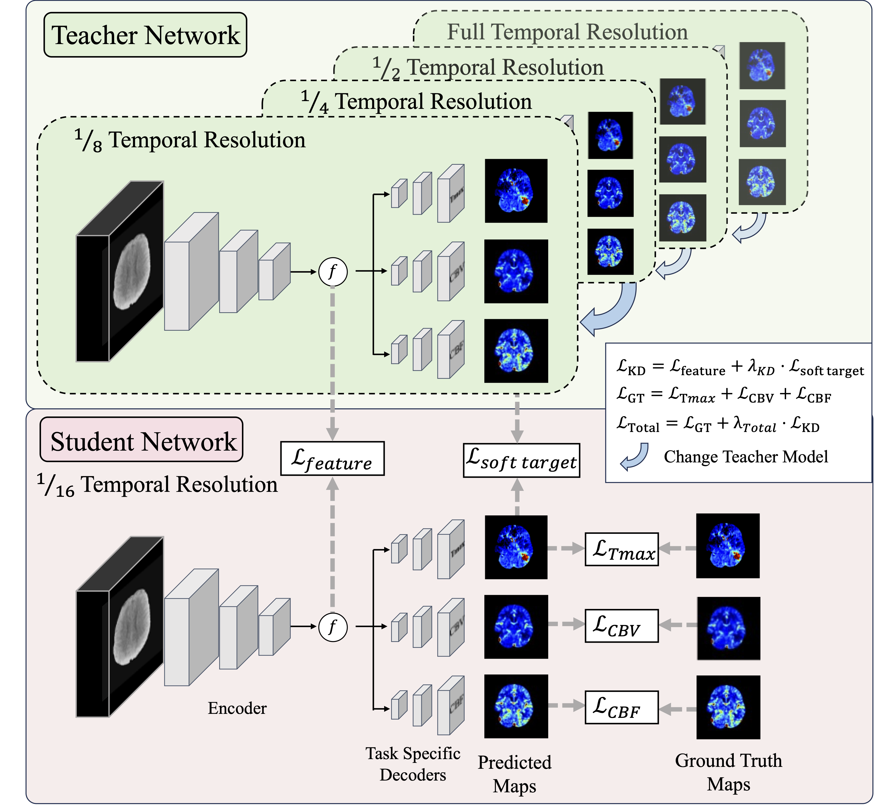

# Progressive Knowledge Distillation

This repository contains the implementation of the research paper titled "Progressive Knowledge Distillation for Automatic Perfusion Parameter Maps Generation from Low Temporal Resolution CT Perfusion Images". 


## Results

Below is an image showing the results achieved using the Progressive Knowledge Distillation method.

## Getting Started

To get started with this project, clone this repository to your local machine using the following command:

```bash
git clone https://github.com/your-username/progressive-knowledge-distillation.git
cd progressive-knowledge-distillation
```

## Requirements
Before Training the model, make sure you have the following requirements installed:

```bash
pip install -r requirements.txt
```
## Training the Model
1. Prepare your dataset in the required format
2. Adjust the configuration files to suit your training needs
3. Run the following command to train the model:

```bash
python train.py --config path/to/config.yaml
```