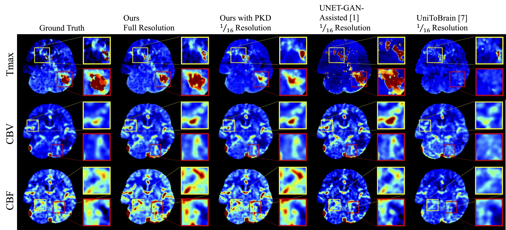

<div align="center">

# <b>[MICCAI 2024]</b> Progressive Knowledge Distillation for Automatic Perfusion Parameter Maps Generation from Low Temporal Resolution CT Perfusion Images</div>
This is the official repository of "[Progressive Knowledge Distillation for Automatic Perfusion Parameter Maps Generation from Low Temporal Resolution CT Perfusion Images](https://link.springer.com/chapter/10.1007/978-3-031-72117-5_57)," presented at **MICCAI 2024**.
> **Progressive Knowledge Distillation for Automatic Perfusion Parameter Maps Generation from Low Temporal Resolution CT Perfusion Images** <br>
> [Moo Hyun (Kyle) Son](mailto:mhson@cse.ust.hk)<sup>1</sup>, [Juyoung (Justin) Bae](mailto:jbaeaa@cse.ust.hk)<sup>1</sup>, [Elizabeth Tong](mailto:etong@stanford.edu)<sup>2</sup>, [Hao Chen](https://www.cse.ust.hk/~haochen/)<sup>1</sup> <br>
> <sup>1</sup>The Hong Kong University of Science and Technology (HKUST)&nbsp;&nbsp;<sup>2</sup>Stanford University <br>
>
> **Abstract.** Perfusion Parameter Maps (PPMs), generated from Computer Tomography Perfusion (CTP) scans, deliver detailed measurements of cerebral blood flow and volume, crucial for the early identification and strategic treatment of cerebrovascular diseases. However, the acquisition of PPMs involves significant challenges. Firstly, the accuracy of these maps heavily relies on the manual selection of Arterial Input Function (AIF) information. Secondly, patients are subjected to considerable radiation exposure during the scanning process. In response, previous researches have attempted to automate AIF selection and reduce radiation exposure of CTP by lowering temporal resolution, utilizing deep learning to predict PPMs from automated AIF selection and temporal resolutions as low as $\frac{1}{3}$. However, the effectiveness of these approaches remains marginally significant. In this paper, we push the limits and propose a novel framework, Progressive Knowledge Distillation (PKD), to generate accurate PPMs from $\frac{1}{16}$ standard temporal resolution CTP scans. PKD uses a series of teacher networks, each trained on different temporal resolutions, for knowledge distillation. Initially, the student network learns from a teacher with low temporal resolution; as the student is trained, the teacher is scaled to a higher temporal resolution. This progressive approach aims to reduce the large initial knowledge gap between the teacher and the student. Experimental results demonstrate that PKD can generate PPMs comparable to full-resolution ground truth, outperforming current deep learning frameworks.

 [Paper](https://link.springer.com/chapter/10.1007/978-3-031-72117-5_57) ·  [Code](https://github.com/mhson-kyle/progressive-kd) · [Poster.](assets/poster.pdf)

<p align="center"></p>

## Getting Started

To get started with this project, clone this repository to your local machine using the following command:

```bash
git clone https://github.com/mhson-kyle/progressive-kd.git
cd progressive-kd
```

### Requirements
Before Training the model, make sure you have the following requirements installed:

```bash
pip install -r requirements.txt
```
### Training
1. Prepare your dataset in the required format
2. Adjust the configuration files to suit your training needs
3. Run the following command to train the model:

```bash
CUDA_VISIBLE_DEVICES=0 python train.py --config path/to/config.yaml
```

### Testing
To evaluate the model, run the following command:

```bash
CUDA_VISIBLE_DEVICES=0 python test.py --experiment_dir path/to/experiment_dir --ckpt best.h5 --stride_xy 16 --stride_z 4
```

### Datasets and Preprocessing
Please refer to the paper for more details on the datasets and preprocessing steps.
Will be updated soon.

### Model Weights
Will be updated soon.

## Results

Below shows the predicted perfusion parameter using the Progressive Knowledge Distillation.


## Citation
If you find this repository useful, please consider citing:

``` bibtex
@inproceedings{Son2024Progressive,
  title={Progressive Knowledge Distillation for Automatic Perfusion Parameter Maps Generation from Low Temporal Resolution CT Perfusion Images},
  author={Son, Moo Hyun and Bae, Juyoung and Tong, Elizabeth and Chen, Hao},
  booktitle={Medical Image Computing and Computer-Assisted Intervention -- MICCAI 2024},
  pages={611--621},
  year={2024},
  publisher={Springer}
}
```